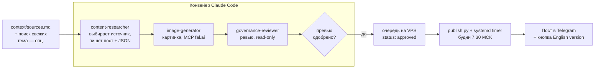
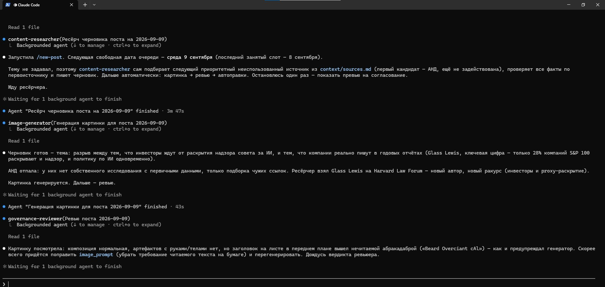
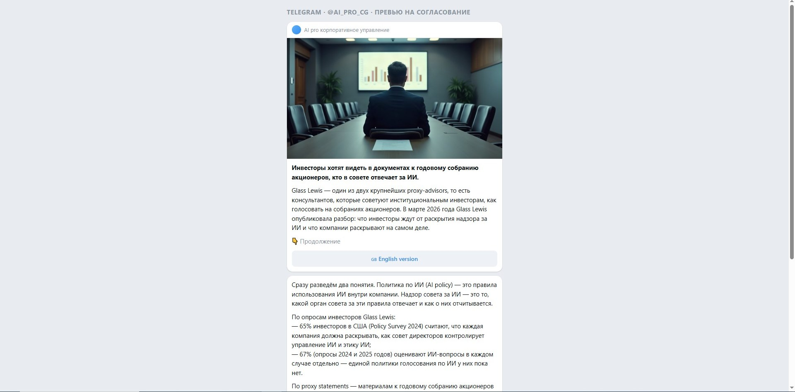
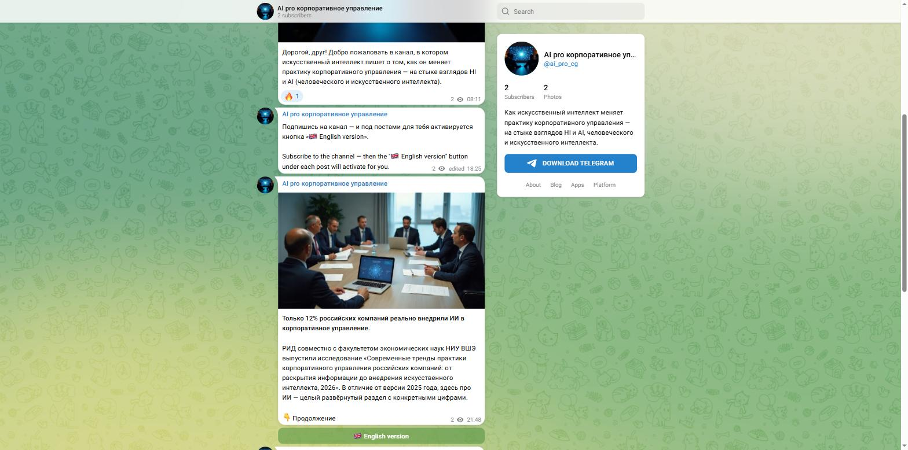

# content-factory

**Конвейер генерации и автопубликации постов для Telegram-канала на стыке
искусственного интеллекта и корпоративного управления.**

Конвейер **сам находит источник** — берёт следующий неиспользованный из
базового списка или ищет свежую публикацию — пишет пост, рисует картинку,
проводит содержательное ревью и публикует по расписанию на отдельном
сервере. Тему задавать необязательно.

🔗 **Живой результат:** [t.me/ai_pro_cg](https://t.me/ai_pro_cg) — канал
публикуется автоматически, один пост в будний день в 7:30 МСК.

---

## Проблема

Вести тематический экспертный канал вручную — это каждый день один и тот
же цикл: найти свежий релевантный материал, вычленить факты и цифры,
написать пост так, чтобы он был полезен практику, а не звучал как
пресс-релиз, сделать картинку без артефактов, проверить факты и стиль,
опубликовать в нужное время. 40–60 минут в день и постоянный риск
пропустить день или опубликовать неточность.

content-factory убирает ручной труд из этого цикла, оставляя человеку одну
ручную точку — одобрить готовый пост. Этим пост встаёт в очередь; публикует
его сервер сам, по расписанию, в назначенный день (может быть через
несколько дней). Решение «публиковать сейчас» человек не принимает.

## Как это работает



- **Ресёрч без ТЗ.** `content-researcher` сам берёт следующий
  неиспользованный источник из `context/sources.md` или ищет свежую
  публикацию по теме, сверяет факты с первоисточником и пишет черновик.
  Тему и ссылку можно задать вручную, но по умолчанию их выбирает агент.
- **Ролевой + последовательный конвейер.** Каждый субагент —
  изолированная роль с собственным контекстом: ресёрч не смешивается с
  ревью, правка текста не тянет за собой пересборку картинки. Оркестратор
  (`content-pipeline`) видит только компактные сводки, а не сырьё каждого
  шага.
- **Ревьюер read-only.** `governance-reviewer` не может сам «подправить»
  находку — любая проблема обязательно всплывает наверх, к человеку.
- **Единственная ручная точка — постановка в очередь.** Статус `approved`
  ставит только человек, одобрив HTML-превью, эмулирующее вид поста в
  Telegram. Это одобрение лишь ставит пост в очередь — дальше сервер
  публикует его сам, в назначенный день. Всё остальное — автоматически.
- **На сервере нет ИИ.** `publish.py` механически берёт самый ранний
  одобренный пост и шлёт через Bot API. Токен бота — только на сервере.

Статусная модель поста: `draft → reviewed → approved → published`.

## Структура репозитория

| Папка | Что внутри |
|---|---|
| `.claude/agents/` | 4 субагента конвейера |
| `.claude/skills/` | скилл проекта `content-factory` + операционные (`content-pipeline`, `new-post`, `ku-ai-social`, `governance-coach`, `telegram-publish`) |
| `.claude/scripts/` | `vps.sh` — обёртка доступа к серверу (пароль не попадает в вывод) |
| `context/` | бренд-гайд, принципы письма, чек-лист ИИ-штампов, список источников |
| `docs/` | [описание проекта](docs/project-description.md), скриншоты |
| `posts/` | результат конвейера — JSON-файлы постов |
| `images/` | сгенерированные картинки |
| `server/` | код для VPS: `publish.py`, `bot_listener.py`, `systemd/` |
| `CLAUDE.md` | рабочие правила проекта (расписание, нормы очереди) |

## Быстрый старт (локально)

Нужен [Claude Code](https://claude.com/claude-code) и MCP-сервер
[fal.ai](https://fal.ai) для генерации картинок.

```bash
git clone <этот-репозиторий>
cd content-factory
# положить ключ fal.ai в .claude/secrets/fal.key
claude
```

В сессии Claude Code:

```
/content-pipeline            # проверит расписание и глубину очереди
/new-post                    # весь конвейер; источник агент выберет сам
/new-post <ссылка или тема>  # то же, но по заданному источнику
```

`/new-post` сам выберет источник (если не задан), пройдёт ресёрч →
картинку → ревью → автоправки и остановится один раз — показать
HTML-превью и дождаться «да».

## Пользовательский сценарий

1. Автор входит в проект, вызывает `/content-pipeline`. Оркестратор
   сообщает: очередь — 8 постов вперёд, дефицита нет / нужно N постов.
2. Автор: `/new-post` — без аргументов. `content-researcher` сам берёт
   следующий приоритетный источник из `context/sources.md` (или ищет
   свежую публикацию), сверяет факты с первоисточником. Конвейер за один
   прогон делает черновик, картинку, ревью, применяет стилевые правки
   сам. (Можно задать ссылку или тему — тогда работает по ним.)
3. Автор получает HTML-превью — точный вид поста в Telegram. Отвечает
   «да». Это единственное его действие: пост встаёт в очередь.
4. Оркестратор ставит `status: approved`, кладёт JSON и картинку в
   очередь на сервере.
5. Сервер сам по будням в 7:30 МСК публикует самый ранний одобренный
   пост — в назначенный ему день, возможно через несколько дней после
   одобрения. Автор в публикации не участвует.

## Скриншоты

**Конвейер в работе: субагенты `content-researcher` → `image-generator` →
`governance-reviewer` отрабатывают один за другим, каждый в своём
изолированном контексте.**



**HTML-превью — точный вид поста в Telegram, показывается на согласование
перед постановкой в очередь.**



**Живой канал: закреплённое двуязычное сообщение и опубликованный пост
(картинка + подпись + кнопка «English version»).**



## Развёртывание автопубликации

Любой VPS с постоянным аптаймом. Подробно — [`.claude/deploy.md`](.claude/deploy.md)
и скилл проекта [`.claude/skills/content-factory/SKILL.md`](.claude/skills/content-factory/SKILL.md).
Коротко: пользователь `cfbot`, папка `/opt/content-factory/`,
systemd-таймер `Mon..Fri 04:30 UTC`, два сервиса (`cf-publish.timer`,
`cf-bot-listener.service`). Исходники — в [`server/`](server/).

## Технологии

Claude Code (субагенты, скиллы) · Python 3 (stdlib, без зависимостей) ·
MCP fal.ai (картинки) · Telegram Bot API · systemd (Ubuntu 24.04) ·
PuTTY plink/pscp. Форматы: JSON, Markdown, HTML.

## Скилл проекта

[`.claude/skills/content-factory/SKILL.md`](.claude/skills/content-factory/SKILL.md)
— точка входа: структура репозитория, запуск конвейера, развёртывание на
сервере, что менять под свой канал.
